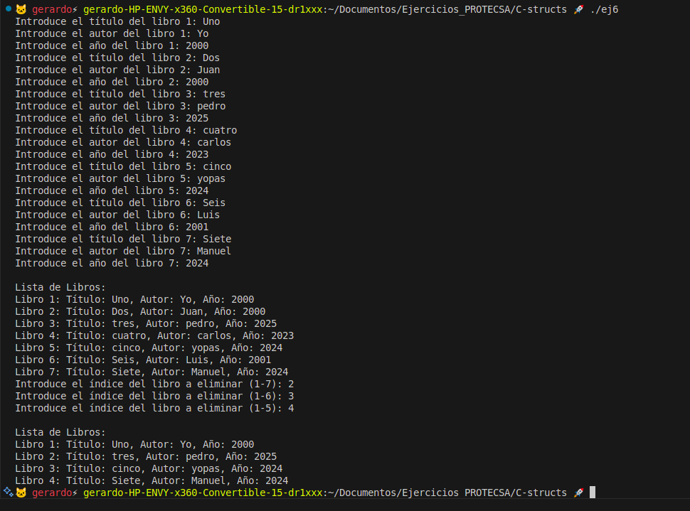
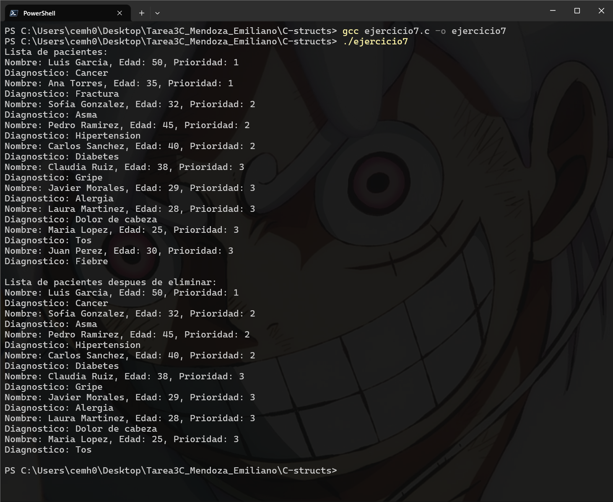

# Tarea 3: Structs en C

## Integrantes

- Carlos Emiliano Mendoza Hernández
- Luis Gerardo Arellano Cortés

## Instrucciones

Ubicandose en la ruta del script, con el siguiente comando se compilan los programas:

```bash
gcc ejercicio1.c -o ejercicio1
```

Y se ejecuta con el siguiente comando:

```bash
./ejercicio1
```

Reemplazando `ejercicio1` por el nombre del programa que se desea ejecutar.

## Capturas de pantalla

### Ejercicio 6



### Ejercicio 7


